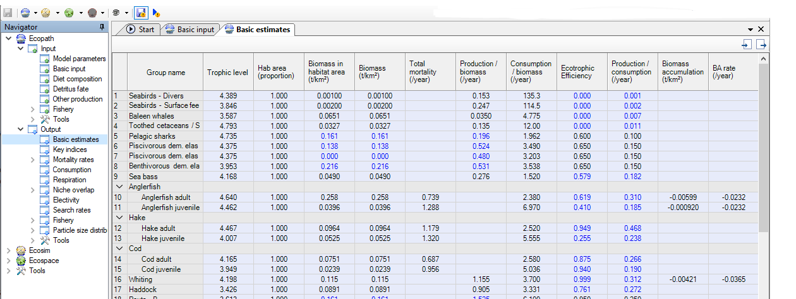

```{r setup, include=FALSE}

library(tidyverse)
library(Rpath)
library(ggplot2)
library(ggrepel)
library(data.table)

```

```{r include=FALSE}
knitr::opts_chunk$set(warning=FALSE, message=FALSE)
```

# Load Ecopath model outputs

We here illustrate our PreBal function using a table of Ecopath results that is directly exported from the Ecopath with Ecosim Users' Interface. 

Once your EwE model is balanced, you can export the basic estimates into a `.csv` file by clicking on the top right corner of the tab, as indicated below:



```{r EwE estimates}

EwE_outputs <- read.csv("data/EwE_exports/basic_estimates_CelticSeaHernvann2023.csv")

info <- read.csv("data/group_additional_info.csv")


EwE_outputs %>%
  dplyr::select(-grep("X", colnames(EwE_outputs))) %>%
  `colnames<-`(c("Group", "TL", "Hab", "BiomassHab", "Biomass", "Z", "PB", "QB", "EE", "ProdCons", "BioAcc", "BioAccRate")) %>%
  mutate(Group=gsub(" - | ", "_", gsub("/ ", "", Group))) %>%
  filter(!is.na(TL)) -> EwE_estimates_balanced

grp_names <- EwE_estimates_balanced$Group
detritus_grp <- EwE_estimates_balanced$Group[EwE_estimates_balanced$TL==1 & is.na(EwE_estimates_balanced$PB)]
PP_grp <- EwE_estimates_balanced$Group[EwE_estimates_balanced$TL==1 & !is.na(EwE_estimates_balanced$PB)]

knitr::kable(EwE_estimates_balanced)

```

Please note that the names of the columns should be provided as described above as the PreBal functions will directly use them to conduct the PreBal diagnostic.

For part of the PreBal diagnostic, we will need to identify the predator-prey interactions in the model. We then upload the diet matrix, exported from the users' interface too.

```{r diet matrix}

EwE_diets <- read.csv("data/EwE_exports/diets_EwE_export_CelticSeaHernvann2023.csv")
  
EwE_diets %>%
  dplyr::select(-"X") %>%
  filter(!Prey...predator%in% c("Sum", "(1 - Sum)")) %>%
  bind_cols(as.data.frame(matrix(0, nrow(EwE_diets)-2, ((nrow(EwE_diets)-3)-(ncol(EwE_diets)-1)+1-length(detritus_grp))))) %>%
  mutate(Prey...predator=c(grp_names, "Import")) %>%
  `colnames<-`(c("DIETS", grp_names[!grp_names %in% detritus_grp])) -> diet_input

```


# Conduct PreBal tests

## Run the function

Let's first load the function used to run the PreBal diagnostic.

```{r load function, messages=FALSE, warnings=F}

source("R/function_run_PreBal.R")

```

You can then use the `run_pRebal` function on your Ecopath model estimates. This function requires mandatory arguments, which are:

- the Ecopath model estimates table

- the component of the PreBal diagnostic, i.e. the values of the Ecopath input/estimate you want to check. Here is an example with the *Biomass* on Trophic Level.

```{r test bio, messages=FALSE, warnings=F, align = 'center',fig.width=16,fig.height=12}

PreBal_test_biomass <- run_pRebal(model_out = EwE_estimates_balanced, varsel = "Biomass")

```

The PreBal systematically plots the graph of the corresponding component of the PreBal diagnostic and stores the numeric outputs of all regressions between the Trophic Level and parameters checked with PreBal.

The graph represents parameters value for each functional group, identified through their #ID in the Ecopath model, and regression lines. The graph can be modified (in a simple way, just for aesthetics) using ggplot.

```{r test bio graph, messages=FALSE, warnings=F,fig.width=16,fig.height=12}

PreBal_test_biomass$plot + theme_dark() + xlab("MY TROPHIC LEVEL")

```

The table stores the coefficients and the R-squared of the regressions performed. The *regid* variable indicates which is parameter that is checked via the regression.

```{r test bio table, echo=T, messages=FALSE, warnings=F,fig.width=16,fig.height=12}

knitr::kable(PreBal_test_biomass$table)

```

The `run_pRebal` allows you to provide complementary information to plot. You can do it by providing a table (same order of functional groups as in your EwE export) where abbreviations of the functional groups, and a class of the functional groups, will be available. Please respect the format and column names of the table so that the function works. The abbreviations will be used to replace the #ID of the functional groups in the table. The class is used to help the analysis of the patterns observed in the Figure.

If the model includes a large number of groups, the abels can overlap so be sure to increase the size of the figure, or modify the plot parameters, to visualize all of them

```{r additional info, messages=FALSE, warnings=F, fig.width=16, fig.height=12}

info <- read.csv("data/group_additional_info.csv")

knitr::kable(info)

PreBal_test_biomass <- run_pRebal(EwE_estimates_balanced, tabinfo=info, varsel="Biomass")

```

In some cases, the regressions may be biased by specific functional groups that are not expected to fit the relationship. In that case, you can exclude some functional groups from the linear regression. This will be reflected by different regression lines, and additional regressions parameters in the table (ending in *_rest*, for *restricted*). Here an example with the check of QB excluding low productive homeotherms.

```{r exclude groups,fig.width=16,fig.height=12}

PreBal_test_biomass <- run_pRebal(EwE_estimates_balanced, tabinfo=info, exclude_class="Homeotherm", varsel="QB")

```

## The different tests

### Biomass


Regarding the biomass, several criteria can be checked:

- The **Biomass** should span 5-7 orders of magnitude

- The **Biomass** should decline with increasing **Trophic Level**. The the slope (on log scale) should be on the order of a ∼5–10% decline with increasing trophic level, across all taxa.

- The number of groups too much above/below the regression line should remain limited.

```{r check B, fig.width=16,fig.height=12}

PreBal_test_biomass <- run_pRebal(EwE_estimates_balanced, tabinfo=info, varsel="Biomass")

```

### Predator/Prey Biomass ratios

Regarding the biomass, several criteria can be checked:

- The ratio between predator and prey biomass should be in most cases <1 and ~ 1-2 decimal places


```{r preypred ratio, fig.width=16,fig.height=12}

PreBal_test_biomass <- run_pRebal(EwE_estimates_balanced, tabinfo=info, dietmatrix=diet_input, varsel="PreyPredRatio")

```


### P/B ratio patterns

Regarding the PB parameter, one major criterion should be checked:

- The **P/B ratio** should decline with increasing **Trophic Level**. *Homeotherms* can be excluded when investigating this relationship (dotted regression line).

```{r check PB, fig.width=16,fig.height=12}

PreBal_test_biomass <- run_pRebal(EwE_estimates_balanced, exclude_class="Homeotherm", tabinfo=info, varsel="PB")

```


### Total Production 

Regarding the Production, one major criterion should be checked:

- The **total Production** should decline with increasing **Trophic Level**


```{r check P, fig.width=16,fig.height=12}

PreBal_test_biomass <- run_pRebal(EwE_estimates_balanced, tabinfo=info, varsel="Ptot")

```


### Q/B ratio patterns

Regarding the QB parameter, one major criterion should be checked:

- The **Q/B ratio** should decline with increasing **Trophic Level**. *Homeotherms* can be excluded when investigating this relationship (dotted regression line).


```{r check QB, fig.width=16,fig.height=12}

PreBal_test_biomass <- run_pRebal(EwE_estimates_balanced, exclude_class="Homeotherm", tabinfo=info, varsel="QB")

```

### Total Consumption

Regarding the Production, one major criterion should be checked:

- The **total Consumption** should decline with increasing **Trophic Level**

```{r check Q, fig.width=16,fig.height=12}

PreBal_test_biomass <- run_pRebal(EwE_estimates_balanced, tabinfo=info, varsel="Qtot")

```

### P/Q ratio patterns

Regarding the PQ parameter, one major criterion should be checked:

- The **P/Q ratio** should fall below 1 for all functional groups. It should be between 0.1 and 0.3 for finfish. For homeotherms, it may be lower.

```{r check PQ, fig.width=16, fig.height=12}

PreBal_test_biomass <- run_pRebal(EwE_estimates_balanced, exclude_class="Homeotherm", tabinfo=info, varsel="ProdCons")

```
